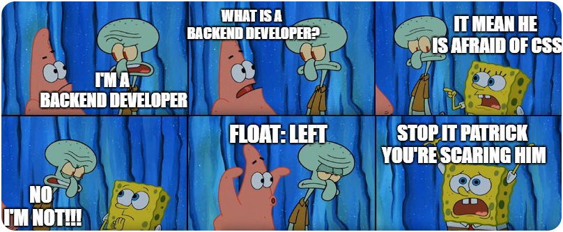

### Hi👋, my name is [Reza Babakhani](https://rezababakhani.ir)

I am a <b>programmer</b>. It's not just my job, it's my lifestyle.
 
About 8 years have passed since the first line of code I wrote.
 
I will never forget the awful codes of those days.
 
Also, I will not forget my determination in learning.
 
I got lost many times on this path. I learned a lot and gained experience.
 
Today I work as a <b>backend</b> developer. Sometimes <b>.Net</b> and sometimes <b>Node</b>.
 
Which tool to use depends on the type of project, the development team and the scale of the project.
 
Also, due to my great interest in mobile programming, I learned <b>Flutter</b> and use it as a hobby.
 
 
When you work in a small team, you cannot have only one task. For this reason, I am familiar with <b>frontend, Devops, SEO, graphic design, product design and content</b>. Of course, without any claims. For example, I know what is a div, but I can't make it center.🤣

 
 

####You can contact🤙 me through email or social networks.
 

 
    
  
     
  

